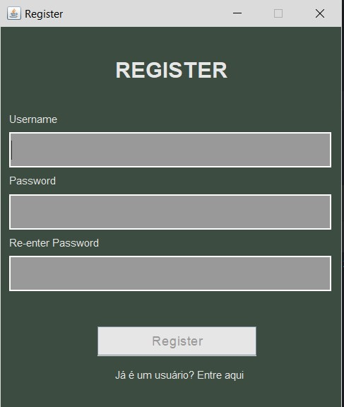
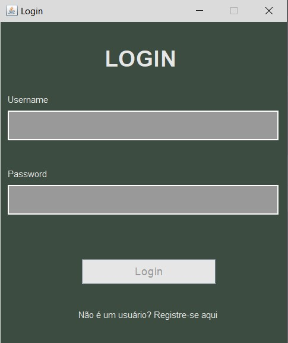

# Login-Register-GUI-DB

## Descrição
<p>Este aplicativo Java é uma interface gráfica de usuário (GUI) que permite aos usuários se registrarem e fazerem login. A aplicação usa um banco de dados SQL para armazenar e recuperar credenciais de usuário. O sistema inclui duas funcionalidades principais:</p>

<p>-Registro de Usuário: Permite que os usuários criem uma conta fornecendo um nome de usuário e uma senha.</p>
<p>-Login de Usuário: Usuários registrados podem fazer login usando suas credenciais.</p>

## Funcionalidades
<p>-Registro de Usuário: Registra novos usuários e armazena suas credenciais no banco de dados SQL</p>
<p>-Login de Usuário: Autentica usuários verificando suas credenciais no banco de dados SQL</p>
<p>-Interface GUI: Interface gráfica para interação</p>
<p>-Banco de Dados SQL: Armazena e recupera credenciais de usuários de forma segura</p>

## Pré-requisitos
<p>-JDK (Java Development Kit) instalado</p>
<p>-Banco de dados SQL (por exemplo, MySQL, SQLite)</p>
<p>-Driver JDBC para o banco de dados escolhido</p>
<p>-IDE Java (por exemplo, IntelliJ, Eclipse)</p>

## Instalação
 1.Clone o Repositório 
 ```
 git clone https://github.com/seuusuario/java-gui-register-login.git
 cd java-gui-register-login
```
  2.Configurar o Banco de Dados
    -Crie um novo banco de dados (se ainda não existir).
    -Crie uma tabela para armazenar as credenciais dos usuários. Por exemplo:
    
    CREATE TABLE usuarios (
    id INT AUTO_INCREMENT PRIMARY KEY,
    username VARCHAR(255) NOT NULL UNIQUE,
    password VARCHAR(255) NOT NULL
    );

  3.Atualize os detalhes da conexão com o banco de dados no código Java

## Exemplos de Capturas de Tela
### Tela de Registro



### Tela de Login



  
